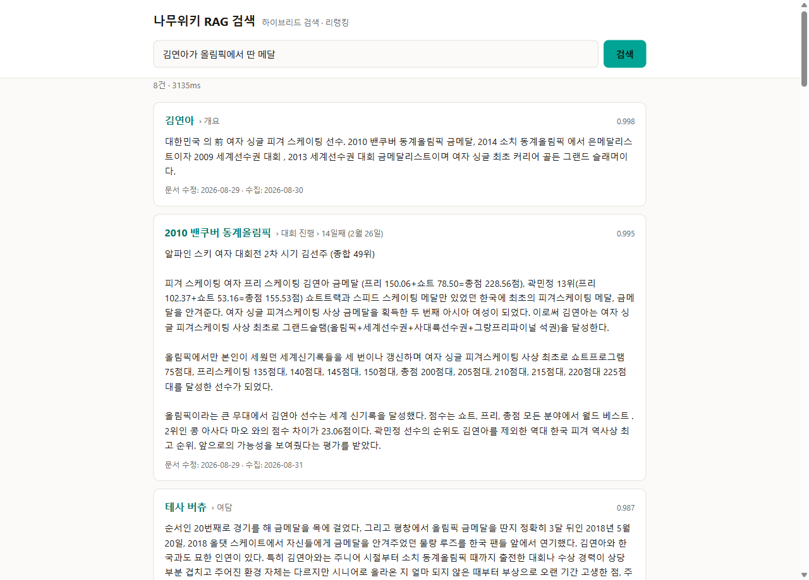
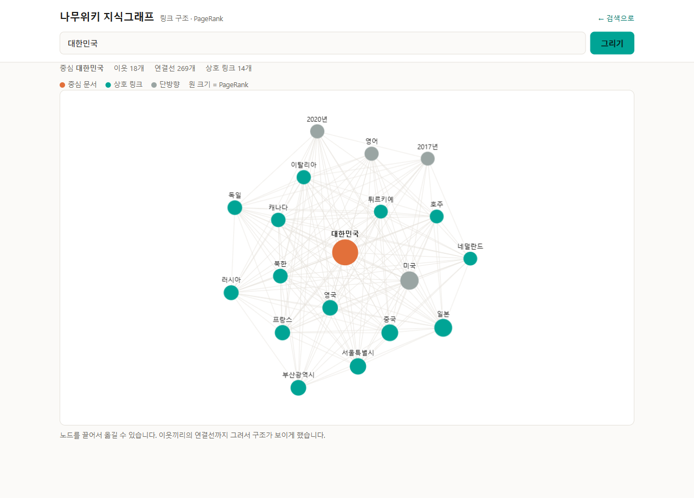

# 나무위키 분산 수집 · RAG 검색

나무위키를 분산 파이프라인으로 수집하고, 하이브리드 검색 + 리랭킹으로 근거 문단을
찾아주는 시스템. 링크와 분류를 지식그래프로 함께 쌓는다.

문서의 모든 수치는 **직접 측정한 값**이다. 추정치는 그렇다고 명시한다.
설계 근거와 실패 기록은 [설계 문서](docs/superpowers/specs/2026-08-28-namuwiki-rag-design.md)에 있다.

---

## 목차

- [지금 상태](#지금-상태)
- [무엇을 만들었나](#무엇을-만들었나)
- [설치](#설치)
- [실행](#실행)
- [검색 사용법](#검색-사용법)
- [지식그래프](#지식그래프)
- [운영](#운영)
- [문제 해결](#문제-해결)
- [설계에서 중요한 결정들](#설계에서-중요한-결정들)
- [라이선스](#라이선스)

---

## 지금 상태

| 항목 | 값 |
|---|---:|
| 수집 문서 | **51,351** |
| 청크 | 1,081,931 |
| 색인 완료 청크 | 147,602 (임베딩 진행 중) |
| 지식그래프 엣지 | **17,230,510** |
| 프런티어 (발견 대기) | 839,877 |
| 리다이렉트 정리 | 4,282 |
| 자동 검증 | **14개 항목 전부 통과** |



*질의 하나에 하이브리드 검색 → RRF 융합 → 리랭킹까지 3.1초. 결과마다 헤딩 경로,
리랭커 점수, 문서 수정 시각과 수집 시각이 함께 나온다.*

검색 품질 (리랭커 점수):

```
김연아가 올림픽에서 딴 메달        0.998  →  김연아 › 개요
파이썬은 어떤 프로그래밍 언어인가   0.998  →  Python › 개요
부산의 지리적 특징                0.998  →  부산광역시 › 지리 > 도시구조 > 특징
축구 경기 규칙                    0.965  →  축구 › 규칙
```

색인에 답이 없을 때는 점수가 0.15~0.19로 떨어진다. **"모른다"를 말할 수 있다**는 뜻이다.

---

## 무엇을 만들었나

### 대상 규모 (나무위키 통계 페이지 실측)

| 항목 | 값 |
|---|---:|
| 문서 (리다이렉트 포함) | 1,894,043 |
| 리다이렉트 비율 | 34.43% |
| **실질 콘텐츠 문서** | **약 124만** |
| 분류 | 232,870 |
| 하루 편집되는 고유 문서 | **33,600** |

### 파이프라인

```
seed_loader ─┐
             ├─▶ frontier ─▶ [crawl.requests] ─▶ crawler ─▶ [docs.raw] ─▶ parser
sidebar.json ┘        ▲                             │                        │
  (10초 폴링)          └──── BFS 링크 수확 ──────────┘                   [chunks.ready]
                                                                             │
                          api ◀── Qdrant ◀── embedder (GPU) ◀────────────────┘
```

각 단계는 **Kafka 토픽으로만 통신**하고 서로를 직접 호출하지 않는다.
`docs.raw`와 `chunks.ready`는 compact 정책으로 영구 보존한다. 그래서:

- **파서를 고쳤다** → `docs.raw` 재생. 재크롤 불필요.
- **임베딩 모델을 바꿨다** → `chunks.ready` 재생. 재크롤·재파싱 불필요.

문서 본문은 최대 16만 자라 Kafka 메시지에 넣을 수 없다. 본문은 블롭 저장소에 두고
토픽에는 참조만 흘린다(**클레임 체크 패턴**). 이 덕분에 추출기를 고쳤을 때 문서 15개를
재크롤 없이 블롭에서 복구할 수 있었다.

### 분산이 실제로 의미 있는 구간

정직하게 말하면 네 단계 중 **하나만** 진짜 분산 문제다.

| 단계 | 병목 | 노드 추가 효과 |
|---|---|---|
| 크롤 | 네트워크 대기 + 상대 서버 배려 | 없음 — 늘리면 안 됨 |
| 파싱 | CPU | 미미 — 단일 노드로 충분 |
| **임베딩** | **GPU** | **선형 — 유일한 진짜 분산 문제** |
| 벡터 검색 | 메모리 | 샤딩 필요 |

크롤러를 컨슈머 그룹으로 만든 것은 성능이 아니라 **장애 격리** 때문이다.

---

## 설치

전제: Docker Desktop, Python 3.12+, NVIDIA GPU(선택 — 없으면 CPU로 동작하지만 매우 느리다).

**1. 인프라**

```bash
docker compose up -d
```

Kafka(KRaft) · PostgreSQL 17 · Qdrant 1.19가 뜬다.

**2. 파이썬 환경**

```bash
python -m venv .venv
```

```bash
.venv/Scripts/python.exe -m pip install -r requirements.txt
```

**3. torch는 CUDA 빌드를 따로 넣는다**

`sentence-transformers`가 PyPI에서 버전 번호가 더 높은 CPU 빌드를 끌어오면
pip이 교체해주지 않는다. 강제로 덮어써야 한다.

```bash
.venv/Scripts/python.exe -m pip install --force-reinstall --no-deps "torch==2.9.0+cu129" --index-url https://download.pytorch.org/whl/cu129
```

```bash
.venv/Scripts/python.exe -c "import torch; print(torch.cuda.is_available())"
```

**4. 스키마 · 토픽 · 컬렉션 생성** (멱등 — 여러 번 돌려도 안전)

```bash
.venv/Scripts/python.exe scripts/init_stack.py
```

---

## 실행

### 소규모 시험 (수백 건)

시드 30개에서 BFS로 퍼뜨린다. 덤프 없이도 동작한다.

```bash
.venv/Scripts/python.exe services/seed_loader.py --from-starter
```

```bash
.venv/Scripts/python.exe services/frontier.py --drain --limit 200
```

```bash
.venv/Scripts/python.exe services/crawler.py --once 200
```

```bash
.venv/Scripts/python.exe services/parser.py --once
```

```bash
.venv/Scripts/python.exe services/embedder.py --once
```

### 검색 서버

```bash
.venv/Scripts/python.exe -m uvicorn api:app --app-dir services --port 8000
```

http://localhost:8000 에서 검색한다. 포트가 쓰이고 있으면 `--port 8010` 처럼 바꾼다.

### 상시 운영 (최신 상태 유지)

네 개를 각각 상주로 띄운다. `frontier`가 변경을 감지하면 나머지가 알아서 흘려보낸다.

```bash
.venv/Scripts/python.exe services/frontier.py
```

```bash
.venv/Scripts/python.exe services/crawler.py
```

```bash
.venv/Scripts/python.exe services/parser.py
```

```bash
.venv/Scripts/python.exe services/embedder.py
```

### 코퍼스 키우기

프런티어에 **84만 건**이 발견된 채 대기 중이다. 원하는 만큼 늘릴 수 있다.

```bash
.venv/Scripts/python.exe services/frontier.py --drain --limit 5000
```

```bash
.venv/Scripts/python.exe services/crawler.py --once 5000
```

```bash
.venv/Scripts/python.exe services/parser.py --once
```

전수(124만)는 동시 4개 기준 **약 70시간**, 다운로드 137~264 GB다.

---

## 검색 사용법

### 웹 UI

http://localhost:8000

### API

```bash
curl "http://localhost:8000/api/search?q=김연아+올림픽+메달&k=5"
```

| 파라미터 | 기본값 | 설명 |
|---|---|---|
| `q` | (필수) | 질의 |
| `k` | 8 | 반환 개수 |
| `candidates` | 100 | 리랭커에 넘길 후보 수 |
| `category` | — | 분류로 좁히기 (예: `1990년 출생`) |
| `expand` | false | 그래프 이웃까지 확장 검색 |

### 검색이 동작하는 방식

```
질의
 ├─▶ dense 검색  (Qdrant, top-100)
 └─▶ sparse 검색 (Qdrant, top-100)
        │
   RRF 융합 (점수 스케일이 달라 단순 가중합은 불안정하다)
        │
   리랭커 (교차 인코더) → top-k
        │
   PageRank 동점 보정
```

리랭커는 색인 비용이 0인데 한국어 벤치마크에서 NDCG@10을 **+3.5%p** 올린다.
비용 대비 효과가 가장 큰 구성요소다.

**PageRank는 동점 보정에만 쓴다.** 관련도 점수에 직접 더하면 인기 문서가 정확한
답을 밀어낸다. 리랭커 점수가 사실상 같을 때만 링크 중심성으로 순서를 정한다.

---

## 지식그래프

나무위키는 링크와 분류 덕분에 그 자체로 지식그래프다. 수집 과정에서 함께 쌓인다.

| 구성요소 | 저장 위치 | 실측 |
|---|---|---|
| 노드 | `documents` | 51,351 |
| 엣지 (내부 링크) | `documents.outlinks TEXT[]` | **17,230,510** (문서당 336) |
| 타입 (분류) | `documents.categories TEXT[]` | 나무위키 전체 232,870 |
| 별칭 (`SAME_AS`) | `redirects` | 4,282 |
| 중심성 | `documents.pagerank` | — |



*`대한민국`을 중심으로 한 부분 그래프. 원 크기는 PageRank, 청록은 상호 링크(서로
가리키는 쌍), 회색은 단방향이다. 이웃끼리의 연결선까지 그려서 별 모양이 아니라
실제 구조가 보이게 했다.*

### 타입 있는 관계 (KG-2)

`outlinks`는 "A가 B를 가리킨다"까지만 말한다. 질문에 답하려면 **어떻게** 연결됐는지가
필요하다 — 김연아의 국적이 대한민국인 것과, 김연아 문서가 대한민국을 언급한 것은
다른 사실이다.

관계를 어디서 얻느냐가 성패를 가른다. 산문에서 LLM으로 뽑으면 비싸고 정밀도가 낮다.
여기서는 네 갈래 모두 규칙으로 뽑는다.

| 출처 | 관계 | 예 |
|---|---|---|
| 인포박스 표 | 라벨이 곧 술어 | `손흥민 --국적--> 대한민국` |
| 슬래시 제목 | `PART_OF` | `김일성/생애 --PART_OF--> 김일성` |
| 분류 | `INSTANCE_OF` | `김연아 --INSTANCE_OF--> 1990년 출생` |
| 리다이렉트 | `SAME_AS` | `옐로우나이프 --SAME_AS--> 옐로나이프` |

```bash
.venv/Scripts/python.exe scripts/extract_relations.py
```

재크롤이 필요 없다. 클레임체크 설계 덕에 원본 HTML이 전부 블롭 저장소에 남아 있어,
새 규칙을 만들 때마다 디스크만 다시 읽으면 된다.

관계마다 **근거**(`evidence`)를 함께 저장한다. 어느 문서의 어느 조각에서 나왔는지
남기지 않으면 틀린 관계를 나중에 추적할 수 없다.

**노이즈를 두 번 잡았다.** 값 셀에 딸려오는 부수 링크(`이순신 --출생--> 음력`)는
스톱리스트로 걸렀고, 문서 뒤쪽 통계표에 같은 라벨이 다시 나오는 문제
(`손흥민 --국적--> 득점 수`)는 **라벨당 첫 행만** 채택해 해결했다. 인포박스는 문서
맨 위에 있으므로 첫 행이 곧 인포박스다.

### 커뮤니티

링크 밀도로 주제 덩어리를 찾는다. 분류와 달리 사람이 붙인 라벨이 아니라 실제 링크
구조에서 나오므로, 분류가 없거나 엉성한 문서도 묶인다.

```bash
.venv/Scripts/python.exe scripts/communities.py
```

Leiden을 쓴다 — Louvain의 후신으로, 연결되지 않은 덩어리가 한 커뮤니티로 묶이는
Louvain의 알려진 결함이 없다. 5.7만 노드 / 740만 엣지가 C 구현으로 몇 분에 끝난다.

커뮤니티는 그래프 화면의 색이 되고, 이웃 선택에도 쓰인다. **PageRank만으로 이웃을
고르면 `손흥민` 주위가 연도와 국가로 채워진다** — 링크는 많지만 주제가 아니다.
같은 커뮤니티를 우선하자 축구 선수·프리미어 리그·박지성으로 바뀌었다.

전수 시 약 **10억 엣지**가 예상된다. 별도 엣지 테이블은 sha1 40자 × 2 × 10억 = 80GB로
과해서 배열 + GIN 인덱스로 뒀다. TOAST 압축이 먹고 역링크 질의도 된다.

```sql
SELECT title FROM documents WHERE outlinks @> ARRAY['김연아'];
```

### 그래프 화면

http://localhost:8000/graph

문서 제목을 넣으면 이웃 관계를 그린다. 노드를 끌어서 옮길 수 있다.
외부 라이브러리 없이 Canvas에 힘 기반 레이아웃을 직접 구현했다.

### 그래프 API

```bash
curl "http://localhost:8000/api/graph?title=대한민국"
```

이웃·역링크·분류·출차수를 돌려준다.

```bash
curl "http://localhost:8000/api/search?q=피겨+스케이팅+점수&expand=true"
```

`expand=true`는 상위 결과와 **상호 링크**된 이웃 문서에서 한 번 더 검색한다.
문서당 링크가 수백 개라 단순 이웃은 너무 넓어서, 서로 가리키는 쌍만 취해 좁혔다.

### 프런티어 우선순위

BFS는 발견 순서가 가치 순서가 아니다. 생물 분류 목록 하나에 걸리면 거기 나열된
윤충 종 이름 수백 개가 큐에 들어오고, 대부분 존재하지 않는 빨간 링크다.
실제로 404율이 2% → 11%로 올랐다.

```bash
.venv/Scripts/python.exe scripts/prioritize_frontier.py
```

인링크 수로 프런티어를 정렬한다. 여러 문서가 가리키는 제목은 실재할 가능성도
검색될 가능성도 높다. PageRank를 쓰지 않는 이유는 **이미 수집한 문서에만 값이
있기 때문**이다 — 아직 안 가져온 문서의 순서를 정하려면 인링크 수가 맞다.

### PageRank

```bash
.venv/Scripts/python.exe scripts/pagerank.py
```

검색 동점 보정과 크롤 우선순위에 반영된다. 문서를 많이 추가한 뒤 한 번 돌리면 된다.

### 로드맵

| 단계 | 내용 | 상태 |
|---|---|---|
| **KG-1** | 문서 그래프 — 링크·분류·이웃확장·PageRank | **완료** |
| **KG-2** | 규칙 기반 관계 추출 — 인포박스·분류·제목·리다이렉트 | **완료** |
| **KG-3** | 커뮤니티 탐지 (Leiden) · 요약은 예정 | 탐지 완료 |

KG-2에서 **LLM 트리플 추출은 쓰지 않는다.** 산문에서 관계를 뽑는 것은 비싸고
정밀도가 낮다. 대신 인포박스(틀 103,689개)에서 타입 있는 관계를 결정론적으로 뽑는다.
DBpedia가 위키백과로 한 방식이다. 자세한 근거는 설계 문서 §13.2에 있다.

---

## 운영

### 상태 확인

```bash
.venv/Scripts/python.exe scripts/smoke_test.py
```

14개 불변식을 점검한다. **이 프로젝트의 조용한 결함은 전부 이걸로 찾았다** —
전부 오류를 내지 않고 데이터만 잘못되는 종류였다.

```
✓ 수집            61260/839877 문서 수집됨
✓ 파싱            documents 51351건
✓ 청킹            chunks 1081931건 (문서당 21.1)
✓ 지식그래프 엣지      17,230,510개 (문서당 336)
✓ 청크 중복 없음      중복 0건
✓ 청크 없는 문서 없음   0건
✓ 카나리아 경보 없음    경보 0건
✓ 임베딩           147602/1081931 청크

통과 14 / 경고 0 / 실패 0
```

### 추출 수율 카나리아

나무위키의 CSS 클래스명은 빌드 해시(`_0MSSsdmG`)라 배포마다 바뀐다.
**추출기는 CSS 셀렉터를 쓰지 않지만**, 그래도 언젠가 깨진다.

기준 문서 5개의 추출 길이를 감시해 **±30% 이탈 시 경보**하고 파서를 정지시킨다.
이게 없으면 빈 문자열로 수백만 청크를 오염시켜도 알아채지 못한다.

실제로 이 카나리아가 리다이렉트 미처리(문서의 5.2%)를 잡아냈다.

### 신선도

나무위키는 하루 33,600개 문서가 바뀐다(실측). 3층으로 대응한다.

| 층 | 방식 | 지연 | 역할 |
|---|---|---|---|
| 1 | `sidebar.json` **10초** 폴링 | 초 | 편집 즉시 큐잉 |
| 2 | `next_due_at` 14일 재방문 | 최대 14일 | 1층이 놓친 것 회수 |
| 3 | `content_hash` 비교 | — | 불필요한 재임베딩 차단 |

**1층이 10초인 이유**: `sidebar.json`은 항목 15개가 약 32초를 덮는 슬라이딩
윈도우다. 30초를 넘겨 폴링하면 그 사이 편집이 **영구 유실**된다.

**3층이 비용을 좌우한다.** 없으면 14일마다 코퍼스 전체를 재임베딩하게 된다.

전수 크롤에 70시간이 걸리는 동안에도 약 10만 문서가 바뀌므로 **일관된 스냅샷은
원리적으로 불가능하다.** 감추는 대신 드러낸다 — 검색 결과마다 문서의 최근 수정
시각과 수집 시각을 함께 표시한다.

### 크롤 정책

나무위키 robots.txt는 `/w/`를 허용하지만, 나무위키 측은 "크롤링은 서버 부담이니
덤프를 받으라"고 안내한다. **허용됐다고 환영받는 건 아니므로** 보호 장치를 코드로
강제한다.

| 항목 | 값 |
|---|---|
| 동시 요청 | 4 (`NW_CRAWL_CONCURRENCY`) |
| 요청 간 최소 간격 | 100ms |
| 서킷 브레이커 | 1분에 429/5xx 10회 → **10분 정지** |
| User-Agent | 연락 가능한 식별자 |
| 접근 경로 | robots.txt Allow 경로만 |

이 값들을 올리기 전에 왜 올려야 하는지 먼저 생각할 것.

### 주요 환경변수

| 변수 | 기본값 | 용도 |
|---|---|---|
| `NW_DEVICE` | 자동 | `cpu`로 강제하면 GPU를 양보한다 |
| `NW_SPARSE_BATCH` | 2 | SPLADE 배치. VRAM이 빠듯하면 1 |
| `NW_VRAM_MARGIN` | 1.05 | VRAM 여유 판정 배수 |
| `NW_BATCH_TIMEOUT` | 600 | 배치 감시견 제한 시간(초) |
| `NW_CRAWL_CONCURRENCY` | 4 | 동시 요청 수 |
| `NW_DENSE_MODEL` | `nlpai-lab/KURE-v1` | dense 임베딩 모델 |

---

## 문제 해결

| 증상 | 원인 · 대처 |
|---|---|
| 임베딩이 안 늘어남 | 로그에 `VRAM 부족`. 다른 GPU 작업이 끝나면 자동 재개된다 |
| 배치가 600초 초과 | 감시견이 프로세스를 종료. 재시작하면 이어서 진행 (커밋 전이라 유실 없음) |
| `청크 없는 문서` 실패 | `scripts/repair_chunkless.py` — 블롭에서 복구 |
| `카나리아 경보` 실패 | 추출기가 깨졌거나 문서가 리다이렉트가 됨. 로그의 길이 변화율 확인 |
| DB↔Qdrant 불일치 | 삭제 tombstone이 대기 중. 임베더를 돌리면 해소 |
| 검색 결과가 이상함 | 해당 문서가 색인됐는지 확인. `SELECT count(*) FROM chunks WHERE embedded_at IS NULL` |

### GPU를 다른 작업과 공유할 때

Windows에는 Linux의 CUDA MPS가 없다. VRAM이 모자라면 **OOM을 내는 대신 호스트
RAM으로 페이징**해서 100배 느려지는데, 에러가 안 나서 "멈춘 것처럼" 보인다.

임베더는 이걸 막기 위해:

1. 시작 전과 배치마다 **nvidia-smi로** 여유 VRAM을 확인하고 부족하면 대기한다
   (`torch.cuda.mem_get_info()`는 WDDM에서 다른 프로세스 점유를 못 봐서 신뢰할 수 없다)
2. 배치가 제한 시간을 넘으면 프로세스를 종료한다
3. 컨슈머 그룹에서 축출돼도 경고만 남기고 계속한다

---

## 설계에서 중요한 결정들

측정이 초기 가정을 뒤집은 지점들이다. 자세한 근거는 설계 문서에 있다.

| 가정 | 실측 |
|---|---|
| 문서 100만 개 | **189만** (실질 124만) |
| 문서당 HTML 1.2MB | **232KB** — 초기 표본이 유명 문서 편향이었다 |
| 텍스트 평균 수만 자 | **중앙값 2,056자** (평균 5,501자, 극단적 롱테일) |
| BGE-M3 한 모델로 dense+sparse 해결 | BGE-M3 dense는 0.5B 그룹 **최하위권**. dense·sparse·리랭커 분리가 정답 |
| 리랭커는 없어도 됨 | **+3.5%p**, 색인 비용 0 |
| 덤프를 콘텐츠 소스로 사용 | 덤프엔 **헤딩 구조가 없다** → 제목 시드로만 사용 |
| 전체 임베딩 30~60시간 | **107~142시간** |
| MinIO로 원본 보관 | **2026-02 저장소 아카이브** → 파일시스템, 확장 시 SeaweedFS |
| 리다이렉트는 따라가면 그만 | 문서의 **5.2%**가 정식 내용을 별칭 제목으로 저장 → 중복 임베딩 |

### 알려진 한계

**네비게이션 박스 누출** — `<details><summary>펼치기·접기</summary>` 형태가 아닌
네비박스가 추출기를 통과한다. 검색 결과에 무관한 목록이 섞일 수 있다.

**크롬 링크 오염** — PageRank 상위에 `편집 요청` 같은 UI 링크가 남아 있다.
제거하려면 링크 수확 범위를 좁혀야 하는데 그러면 **인포박스가 함께 사라진다**
(대한민국 1,468 → 839개). 인포박스는 KG-2에서 가장 값어치 있는 소스라 그 교환은
손해다. 코퍼스가 커지면 통계로 거르는 게 맞다. 근거는 설계 문서 §13.1.1.

**모델 품질 자체 검증 미완** — 공개 한국어 검색 벤치마크는 특정 벤더 모델이 전
부문 1위인데 벤치마크 저장소와의 관계가 분리 검증되지 않는다. 처리량은 자체
측정했지만 품질은 `scripts/eval_models.py`로 직접 재야 한다.

---

## 라이선스

**코드**는 [MIT](LICENSE).

**나무위키 본문**은 [CC BY-NC-SA 2.0 KR](https://creativecommons.org/licenses/by-nc-sa/2.0/kr/)이다.
출처 표시 · **비영리** · 동일조건변경허락 의무가 있다.

이 프로젝트는 비영리 연구용이며, 검색 결과에 항상 원문 링크와 라이선스 고지를
포함한다. 사용하는 모델·소프트웨어는 전부 MIT 또는 Apache 2.0이다.
